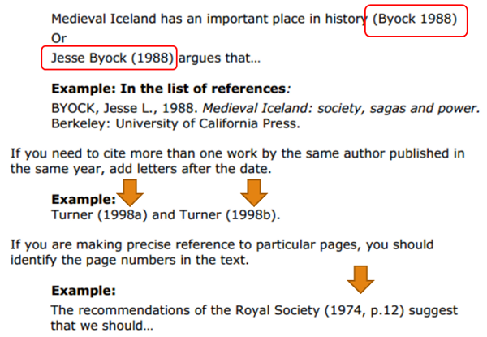
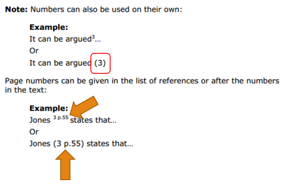
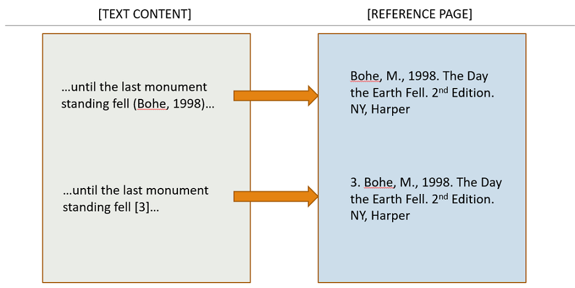

# SOLab Citation Style

說明引用文獻風格。

---

- [風格](#風格)
- [範本](#範本)
    - [期刊論文 Journal Paper](#期刊-Journal-Paper)
    - [研討會論文 Conference Paper](#研討會-Conference-Paper)
    - [碩博士論文 Master/Doctoral Thesis](#碩博士論文-Master/Doctoral-Thesis)
    - [技術報告 Technique Report](#技術報告-Technique-Report)
    - [技術文件 Manual](#技術報告-Technique-Report)
    - [書籍 Book](#書籍-Book)
    - [網頁 Websites](#網頁-Websites)
- [補充說明](#補充說明)

---

## 風格

- 主要使用 bibtex ieeetr style。
- 不同作者以逗號 ", " 區隔，最後兩位作者以 "and " 區隔。
- 名在前，常用 ". " 做縮寫，姓在後，完整保留。
- 中文姓名依照作者拼音法，使用威妥瑪拼音則用 "-" 區隔名；使用漢語拼音則用開頭字母，如：黃廣州 (威妥瑪 K.-C. Huang；漢語 K. Huang)。
- 若作者為某組織，則直接用組織名稱。

## 範本

### 期刊論文 Journal Paper

```bibtex
% 期刊雜誌的論文

@article{label,
  author   = {P. Adams}, 
  title    = {The title of the work},
  journal  = {The name of the journal},
  year     = 1993,
  number   = 2,
  volume   = 4,
  pages    = {201-213},
  month    = 7,
}
```

-  J. Wu, J. Wang, and Z. You, “An overview of dynamic parameter identification of robots.” Robotics and Computer-Integrated Manufacturing, vol. 26, no. 5, pp. 414–419, 2010.
-  A. Bittencourt and P. Axelsson, “Modeling and experiment design for identification of wear in a robot joint under load and temperature uncertainties based on friction data.” IEEE/ASME Transactions on Mechatronics, vol. 19, pp. 1694–1706, Oct 2014.

```bibtex
% 未出版的論文，圖書

% 必須將所有能幫助讀者找到文獻的資訊都放在 note

@unpublished{label,
  author  = {P. Marcheford}, 
  title   = {The title of the work},
  note    = {An optional note},
  month   = 7,
  year    = 1993
}
```
    
- I. H. Spud, "Constrastive analysis: A comparison of Pig Latin and English." Unpublished manuscript, 1999.
- A. Nala, "Teaching vocabulary: Evidence from research in Pig Latin." Unpublished manuscript, Brigham Young University, Provo, UT., 1998.
- F. Roosevelt, "Childhood acquisition of Pig Latin by native speakers of English." Manuscript submitted for publication, 1997.

### 研討會論文 Conference Paper

```bibtex
% 會議論文集中的論文

% 必須寫出地點 (address)

@inproceedings(or @conference){label,
  address    = {Location},
  author     = {P. Draper}, 
  title      = {The title of the work},
  booktitle  = {The title of the book},
  year       = 1993,
  volume     = 4,
  number     = 2,
  pages      = 213,
  month      = 7,
}
```

- Z. Gao, P. Wang, L. Bertling, and J. Wang, “Sizing of Energy Storage for Power Systems with Wind Farms Based on Reliability Cost and Wroth Analysis.” in _Power and Energy Society General Meeting, 2011 IEEE_, (Detroit, MI, United States), pp. 1–7, 2011.

### 碩博士論文 Master/Doctoral Thesis

```bibtex
% 碩士論文

@mastersthesis{label,
  author   = {P. Harwood}, 
  title    = {The title of the work},
  school   = {The school of the thesis},
  address  = {The address of the publisher},
  year     = 1993,
  month    = 7,
}
```
- V. Nannen, "The Paradox of Overfitting." Master’s thesis, Rijksuniversiteit Gronin-gen, the Netherlands, 2003.

```bibtex
% 博士論文

@phdthesis{label,
  author   = {P. Joslin}, 
  title    = {The title of the work},
  school   = {The school of the thesis},
  address  = {The address of the publisher},
  year     = 1993,
  month    = 7,
}
```

- V. Nannen, _The Paradox of Overfitting._ PhD thesis, Rijksuniversiteit Groningen, the Netherlands, 2003.


### 技術報告 Technique Report

```bibtex
% 教育、商業機構的技術報告

@techreport{label,
  author     = {P. Lambert}, 
  title      = {The title of the work},
  publisher  = {Profanity Institute},
  address    = {New York NY},
  year       = 1993,
  volume     = 249,
  number     = 2,
  month      = 7,
}
```

- R. Swearingen. Morpholoty and syntax of british sailors’ english. Technical report, New York NY, 1985.

### 技術文件 Manual

```bibtex
% 技術文檔

@manual{label,
  title        = {The title of the work},
  author       = {P. Gainsford}, 
  organization = {The organization},
  address      = {The address of the publisher},
  edition      = 3,
  month        = 7,
  year         = 1993,
  note         = {An optional note}
}
```

### 書籍 Book

```bibtex
% 公開出版的圖書

@book{book,
  author    = {P. Babington}, 
  title     = {The title of the work},
  publisher = {The name of the publisher},
  year      = 1993,
  volume    = 4,
  series    = 10,
  address   = {The address},
  edition   = 3,
  month     = 7,
  note      = {An optional note},
  isbn      = {3257227892}
}
```

```bibtex
% 無出版商或作者的圖書

@booklet{booklet,
  title        = {The title of the work},
  author       = {P. Caxton}, 
  howpublished = {How it was published},
  address      = {The address of the publisher},
  month        = 7,
  year         = 1993,
  note         = {An optional note}
}
```

```bibtex
% 書籍的一部分章節

@inbook{inbook,
  author       = {P. Eston}, 
  title        = {The title of the work},
  chapter      = 8,
  pages        = {201-213},
  publisher    = {The name of the publisher},
  year         = 1993,
  volume       = 4,
  series       = 5,
  address      = {The address of the publisher},
  edition      = 3,
  month        = 7,
  note         = {An optional note}
}
```

```bibtex
% 書籍中帶獨立標題的章節

@incollection{incollection,
  author       = {P. Farindon}, 
  title        = {The title of the work},
  booktitle    = {The title of the book},
  publisher    = {The name of the publisher},
  year         = 1993,
  editor       = {The editor},
  volume       = 4,
  series       = 5,
  chapter      = 8,
  pages        = {201-213},
  address      = {The address of the publisher},
  edition      = 3,
  month        = 7,
  note         = {An optional note}
}
```

### 網頁 Websites

```bibtex
% 政府、個人、新聞、線上期刊 ... 等網頁資料

% title 後綴資料型別：
%     - [On-line serial]：線上期刊，若有 volume/number/pages 則後綴
%     - [WWW page]：網頁
%     - [Discussion]：討論區文章
%     - [News Bulletin]：新聞
%     - [Text File]：文字檔
%     - [Video File]：影片檔

% howpublished 前綴來源方法：
%     - URL：網址
%     - Available E-mail：電子信箱

% note 紀錄擷取時間
%     - Retrieved month day, year

@misc{label,
  author        = {P. Isley}, 
  title         = {The title of the work},
  howpublished  = {How it was published},
  month         = 7,
  year          = 1993,
  note          = {An optional note},
}
```

- H. P. Bacon, "The pig pen: Frequently asked questions about Pig Latin [WWW page]." URL https<span></span>://www<span></span>.test.org/test.<span></span>html.
- N. Ontoast, "Communication games for the public school Pig Latin classroom. E-Journal of PL Studies [On-line serial], 16." Available E-mail: test<span></span>@test.com Message: get EJPLS, 1996.
- 台灣電力股份有限公司, "過去電力供需資訊 [WWW page]." URL http<span></span>://www<span></span>.taipower.<span></span>com.tw. 存取時間:2015-12-15.

---

## 補充說明

- Definition

    - Referencing: creating a bibliographic description (a reference) of a source used in an accurate and consistent way.
    - Citing: referring from the text to the sources used.

    In fewer words, to avoid plagiarism, when using other people’s work in one’s paper, credit needs to be given to the original author in the reference section.

- The different citations in a text

    - Harvard system (name and date)

        

    - Numeric system

        

- Illustration

    

---

## 參考資料

1. [Citation Styles: APA, MLA, Chicago, Turabian, IEEE: APA 6th Edition](https://pitt.libguides.com/c.php?g=12108&p=64730)
2. [BibTeX wiki](https://zh.wikipedia.org/wiki/BibTeX)
3. [linguistics.byu.edu APA01](http://linguistics.byu.edu/faculty/henrichsen/APA/APA01.html)
4. [verbosus.com](https://verbosus.com/bibtex-style-examples.html)
5. [Bournemouth Univ., 2012. How to cite references: BU Harvard style](http://www.bournemouth.ac.uk)
6. [The University of Nottingham, 2013/2014. How to cite references](http://www.nottingham.ac.uk)
