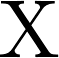
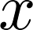
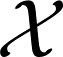

# SOLab Math Symbol Style

此處數學風格僅代表 SOLab 一般性原則，文中保持一致風格即可，投稿時請依照期刊規定。

---

1. 正體代表單位或文字

     &nbsp;&nbsp;&nbsp;&nbsp; 
    $\mathrm{x}$, $\mathrm{X}$
2. 小寫斜體代表定性變數 $x$, $\mathbf x$

    

3. 大寫斜體、\mathcal、\varepsilon **可代表** 隨機變數 $X$, $\mathcal X$, $\varepsilon$

     &nbsp;&nbsp;&nbsp;&nbsp;  &nbsp;&nbsp;&nbsp;&nbsp; 

4. 細體代表純量 $x$

    

5. 粗體代表向量、矩陣 $\mathbf x$, $\mathbf X$

    

6. 數值和單位或文字間應有一格空白。

    

7. 在句子中呈現數學算式，且該算式後面接著標點符號時，則算式與標點符號之間須有一格空白。如：... 如右式計算 x + y = z 。
