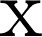

# SOLab Math Symbol Style

此處說明僅代表 SOLab 一般性原則，文中保持一致風格即可，投稿時請依照期刊規定。

---

1. 小寫斜體細字代表確定性變數 (deterministic variable)

     = x

2. 大寫斜體細字或 varepsilon **可代表** 隨機變數 (random variable)

     = X

     = \mathcal{x}

     = \varepsilon

3. 粗字代表向量、矩陣 (很少看到斜體+粗字)

     = \mathbf{X}
    
     = \mathbf{x}

4. 正體細字代表單位或文字

     = \mathrm{X}

     = \mathrm{x}

5. 數值和單位或文字間應有一格空白

    

6. 在文章句子中呈現方程式，且該式後面接著標點符號時，則方程式與標點符號之間須有一格空白
