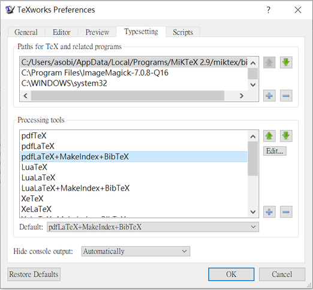
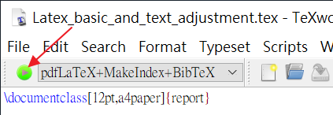
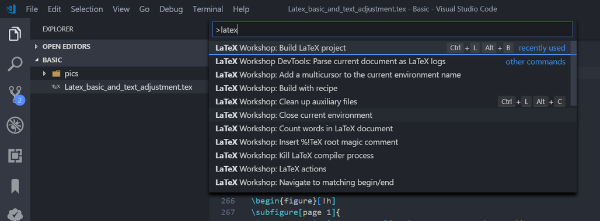
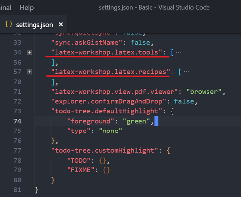

# Compile

- [TeXworks](#TeXworks)
- [VSCode](#VSCode)
- [Terminal](#Terminal)

## TeXworks

工具列 File -> Preference 可以看到下圖視窗，可以看到編譯程式與順序。



點擊主程式下圖按鈕可以開始編譯文件。



## VSCode

按下 Ctrl+Shift+P 執行命令，執行 LaTeX Workshop: Build LaTeX project。



其編譯程序可以打開 settings.json 設定，如下圖 latex-workshop.latex.tools 與 latex-workshop.latex.recipes 兩個變數。



其內容可以參考下方或下一節 Terminal 命令。[參考](https://zhuanlan.zhihu.com/p/38178015)
```
{
    "workbench.settings.editor": "json",
    // https://zhuanlan.zhihu.com/p/38178015
    "latex-workshop.latex.tools": [
        {
            // 编译工具和命令 
            "name": "xelatex",
            "command": "xelatex",
            "args": [
                "-synctex=1",
                "-interaction=nonstopmode",
                "-file-line-error",
                "-pdf",
                "%DOCFILE%"
            ]
        },
        {
            "name": "pdflatex",
            "command": "pdflatex",
            "args": [
                "-synctex=1",
                "-interaction=nonstopmode",
                "-file-line-error",
                "%DOCFILE%"
            ]
        },
        {
            "name": "bibtex",
            "command": "bibtex",
            "args": [
                "%DOCFILE%"
            ]
        }
    ],
    "latex-workshop.latex.recipes": [
        {
            "name": "xelatex",
            "tools": [
                "xelatex"
            ]
        },
        {
            "name": "xe->bib->xe->xe",
            "tools": [
                "xelatex",
                "bibtex",
                "xelatex",
                "xelatex"
            ]
        }
    ]
}
```
Recipes 第一個為預設，也可以將`xe->bib->xe->xe`放在第一個，但速度較慢。
設定 wordWrap: open the command pallette (ctrl - shift - p), select Preferences: `Configure language specific settings...` and select the latex language. Then add the following:
```
"[latex]": {
    "editor.wordWrap": "on"
},
```

## Terminal

直接在 terminal 輸入命令進行編譯，主要使用 pdflatex 或是 xelatex。

LaTeX 編譯器不支援增量編譯，因此當文件中有目錄或是引用文獻時，則需要 .toc 或 .aux 檔存在，因此根據文件內容的不同，有時會需要好幾次命令執行編譯。

- 文件
```bash
pdflatex file.tex
```

- 包含目錄 \tableofcontents
```bash
pdflatex file.tex
pdflatex file.tex
```

- 包含文獻 \bibliography
```bash
pdflatex file.tex
bibtex   file.aux
pdflatex file.tex
pdflatex file.tex
```

