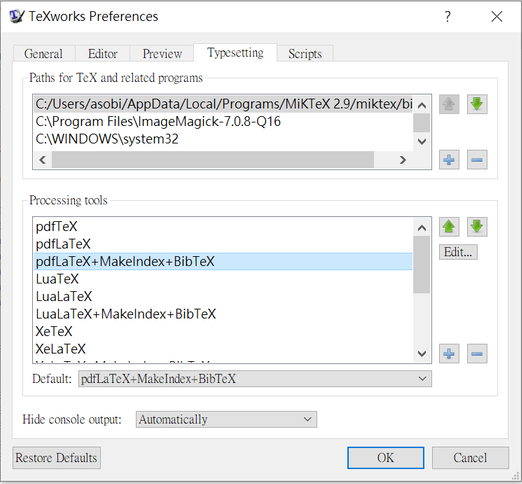

# Compiler

使用 LaTeX 製作文件需要編譯器，將使用者撰寫的指令稿編譯成 pdf 檔。

之前我們都是用 pdflatex 編譯，但忘記哪一次更新後突然就不能使用中文，因此我們加入 xelatex 作為另一種選擇，而論文的 Template 由於是參考別人的設定，因此也是用 xelatex。

目前兩種方法都可以使用，差別可參考 Template / Homework，以下說明幾種編譯的方法。

- [Terminal](#Terminal)
- [TeXworks](#TeXworks)
- [VSCode](#VSCode)

---

## Terminal

在 terminal 輸入命令進行編譯是最直接簡單的方法，由於 LaTeX 編譯器不支援增量編譯，因此當文件中有目錄或是引用文獻時，則需要 .toc、.aux、.bbl 檔存在，因此根據文件內容的不同，有時會需要好幾次命令執行編譯。

以下 pdflatex 亦可更換為 xelatex。

- 簡單文件
```bash
pdflatex filename.tex
```

- 有目錄 `\tableofcontents`
```bash
pdflatex filename.tex
pdflatex filename.tex
```

- 有文獻 `\bibliography`
```bash
pdflatex filename.tex
bibtex   filename
pdflatex filename.tex
pdflatex filename.tex
```

以下透過編輯器進行編譯，其實也是編輯器呼叫上述命令，只是可以比較自動化。

---

## TeXworks

在 Windows 使用 Miktex 預設使用 TeXworks 作為編輯器，在工具列 File -> Preference 可以看到下圖視窗，可以看到編譯程式與順序，點擊 Edit 可以看到是呼叫 texify.exe，估計是此程式會更據選項的不同，而去呼叫編譯器。

||
|:-:|

點擊主程式下圖按鈕可以開始編譯文件。

||
|:-:|

---

## VSCode

按下 Ctrl+Shift+P 執行命令，執行 LaTeX Workshop: Build LaTeX project。

||
|:-:|

其編譯程序可以打開 settings.json 設定，如下圖 latex-workshop.latex.tools 與 latex-workshop.latex.recipes 兩個變數。

||
|:-:|

其內容可以參考下方或下一節 Terminal 命令。[參考](https://zhuanlan.zhihu.com/p/38178015)

```
{
    "latex-workshop.latex.autoBuild.run": "never",
    "latex-workshop.latex.tools": [
        {
            "name": "xelatex",
            "command": "xelatex",
            "args": [
                // "-synctex=1",
                "-interaction=nonstopmode",
                "-file-line-error",
                "%DOCFILE%"
            ]
        },
        {
            "name": "pdflatex",
            "command": "pdflatex",
            "args": [
                "-synctex=1",
                "-interaction=nonstopmode",
                "-file-line-error",
                "%DOCFILE%"
            ]
        },
        {
            "name": "bibtex",
            "command": "bibtex",
            "args": [
                "%DOCFILE%"
            ]
        }
    ],
    "latex-workshop.latex.recipes": [
        {
            "name": "pdf-pdf",
            "tools": [
                "pdflatex",
                "pdflatex"
            ]
        },
        {
            "name": "xe-bib-xe-xe",
            "tools": [
                "xelatex",
                "bibtex",
                "xelatex",
                "xelatex"
            ]
        },
        {
            "name": "pdf-bib-pdf-pdf",
            "tools": [
                "pdflatex",
                "bibtex",
                "pdflatex",
                "pdflatex"
            ]
        },
        {
            "name": "xelatex",
            "tools": [
                "xelatex"
            ],
        },
        {
            "name": "pdflatex",
            "tools": [
                "pdflatex"
            ]
        },
    ],
}
```

Recipes 第一個為預設。

設定 wordWrap: open the command pallette (ctrl - shift - p), select Preferences: `Configure language specific settings...` and select the latex language. Then add the following:

```
"[latex]": {
    "editor.wordWrap": "on"
},
```
