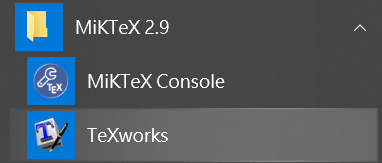
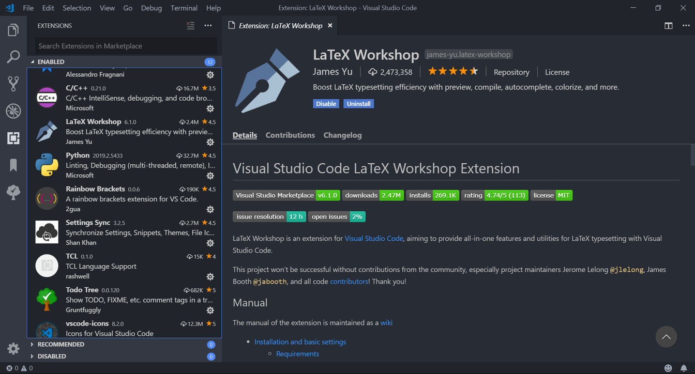
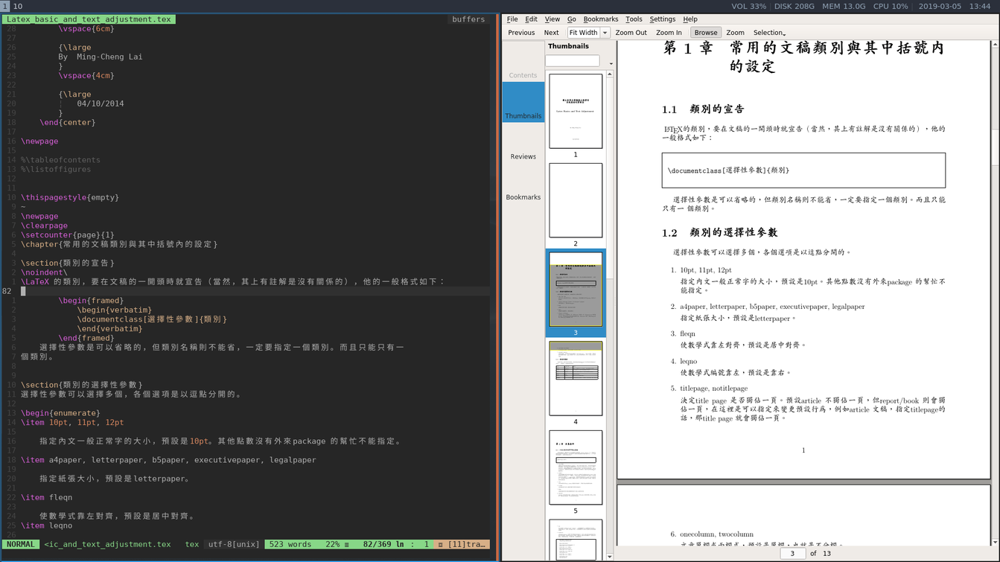
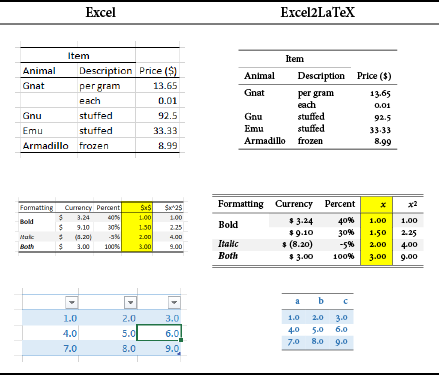
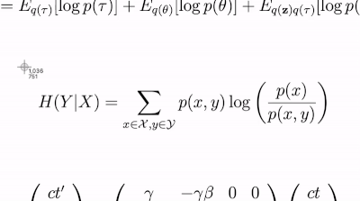
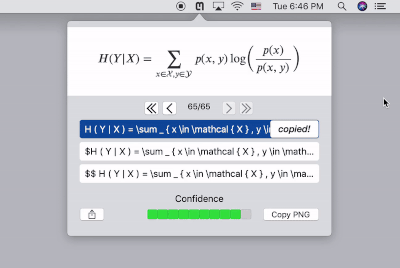

# Introduction

- Install Compiler
    - [Windows](#Windows)
    - [Ubuntu](#Ubuntu)
- Editor
    - [TeXworks](#TeXworks)
    - [VSCode](#VSCode)
    - [Vim](#Vim)
    - [Overleaf](#Overleaf)
- Others
    - [IguanaTex](#IguanaTex)
    - [Mathpix](#Mathpix)

---

## 1. Install Compiler

使用 LaTeX 需要一個編譯器，將使用者撰寫的指令稿編譯成 pdf 檔，而目前對於內文含中文的文件來說，XeLaTeX 是最常用的編譯器。以下分為 Window 與 Linux 環境的安裝說明。

### Windows

安裝 MiKTeX ( https://miktex.org/download )

編譯文件的過程中若有缺少的 Package (.sty)，MikTex 會顯示安裝提示。若是自行下載的 Package，則放在與文件相同資聊夾下即可。

缺少的字體，下載後放在以下資料夾：

```
C:/Windows/Fonts/
```

### Ubuntu

安裝 texlive-full

```bash
sudo apt install texlive-full
```

缺少的字體，下載後放在以下資料夾：

```
/usr/local/share/fonts/
```

或是
```
~/.local/share/fonts/
```

**字型 Fonts**

建議另外安裝 cwtex-q-fonts ( https://github.com/l10n-tw/cwtex-q-fonts )，並使用 XeLaTeX 針對不同的字型進行設定。

---

## 2. Editor

### TeXworks

至 http://www.tug.org/texworks/ 下載。

在 Windows 安裝 MiKTeX 會自動安裝 Texworks。



### VSCode

至 https://code.visualstudio.com/ 下載。

開啟 extension 搜尋 Latex Workshop 並安裝，此擴充套件提供 VSCode 呼叫編譯器、語法顏色、自動補全等功能。



### Vim

下圖使用 vim 編輯、使用 okular 瀏覽 pdf，手動輸入命令進行編譯。



### Overleaf

參考 https://www.overleaf.com/

線上多人協同編輯與編譯器，缺點是編譯速度較慢。

---

## 3. Others

其他 LaTeX 相關的資源。

### IguanaTex

參考 http://www.jonathanleroux.org/software/iguanatex/

在 Windows 作業系統下安裝了 Miktex 與 PowerPoint 後，可以在 PowerPoint 安裝 IguanaTex 增益集，它提供了在投影片中插入 LaTeX 方程式的功能。注意安裝完成後，還需要安裝 GhostScript 與 ImageMagick，並修改 IguanaTex 相關設定，如下圖。


### Ex­cel2LATEX

參考 https://www.ctan.org/tex-archive/support/excel2latex

在 Excel 內安裝 excel2latex 增益集，它提供將選取的儲存格轉成 LaTex 表格。



### Mathpix

參考 https://mathpix.com/

辨識方程式圖片，轉成 latex script，跨平台、目前還沒看到收費。




## 在线 LaTeX 公式编辑器-妈叔出品

參考 https://www.latexlive.com/

Help 文件整理了 Equation 的一些符號與使用範例。
