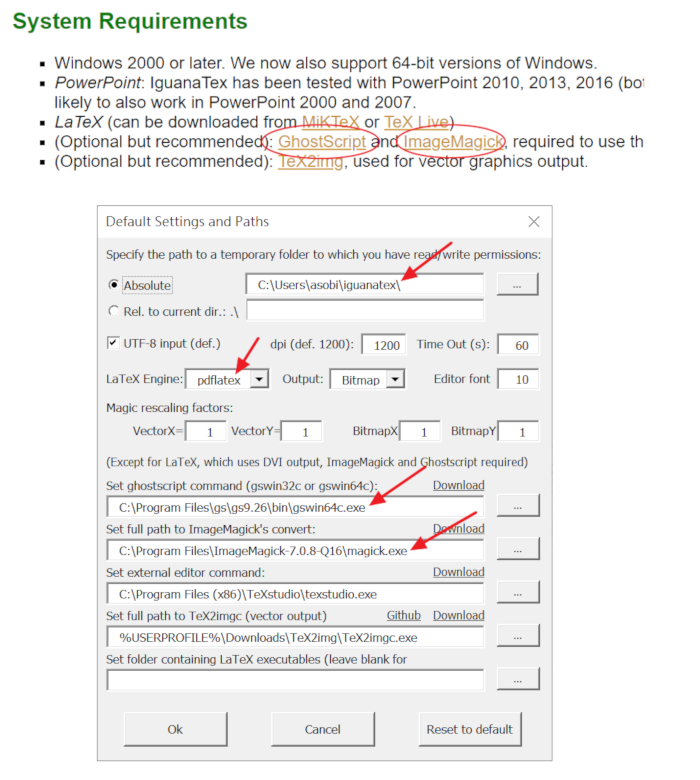

# Introduction

- Install Compiler
    - [Windos](#Windows)
    - [Ubuntu](#Ubuntu)
- Editor
    - [TeXworks](#TeXworks)
    - [VSCode](#VSCode-LaTex-Workshop)
    - [Vim](#Vim-Terminal)
- Online Editor
    - [Overleaf](#Overleaf)
- PowerPoint Extension
    - [IguanaTex](#IguanaTex)

## Install Compiler

### Windows

下載並安裝 MiKTeX (https://miktex.org/download)

編譯文件的過程中會顯示需要安裝的 Package。

### Ubuntu

```bash
sudo apt install texlive-full
```

標楷體、新細明體 ... 等字型，自行下載後 (或是由 Windows 的 C:/Windows/Fonts/ 中複製)，放在以下 Ubuntu 的資料夾

```
/usr/local/share/fonts/
```

若有缺少的 Package (.sty)，自行下載後放在與文件相同資料夾即可。

## Editor

### TeXworks

至 http://www.tug.org/texworks/ 下載。

在 Windows 安裝 MiKTeX 會自動安裝 Texworks。


### VSCode + LaTeX Workshop

至 https://code.visualstudio.com/ 下載。

開啟 extension 搜尋 Latex Workshop 並安裝，此擴充套件提供 VSCode 編譯、語法顏色、自動補全 Latex 等功能。


### Vim + Terminal

下圖使用 vim 編輯，手動輸入命令進行編譯，使用 okular 瀏覽 pdf。


## Online Editor

### Overleaf

參考 https://www.overleaf.com/

線上多人協同編輯與編譯器，缺點是編譯速度較慢、不確定是否支援 bibtex。

## PowerPoint Extension

### IguanaTex

參考 http://www.jonathanleroux.org/software/iguanatex/

在 PowerPoint 安裝增益集，可以插入 Latex 的方程式，安裝完成後，還需要安裝 GhostScript 與 ImageMagick，然後開啟 IguanaTex 的設定，如下圖。


