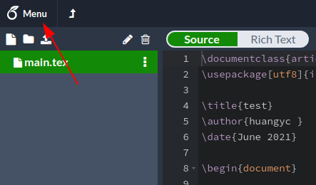
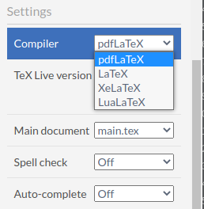

# Introduction

## 1. Install

以下分為 Window 與 Linux 環境的安裝說明。

### 1.1 Windows

安裝 MiKTeX ( https://miktex.org/download )

編譯文件的過程中若有缺少的 Package (.sty)，MikTex 會顯示安裝提示。若是自行下載的 Package，則放在與文件相同資聊夾下即可。

### 1.2 Linux

#### Ubuntu

透過下列命令安裝 texlive-full

```bash
sudo apt install texlive-full
```

如果硬碟不夠大，可以先安裝所需的部份

``` bash
sudo apt install texlive-base texlive-binaries texlive-font-utils \
    texlive-fonts-recommended texlive-lang-chinese texlive-lang-cjk \
    texlive-lang-japanese texlive-lang-korean texlive-lang-other \
    texlive-latex-base texlive-latex-extra texlive-latex-recommended \
    texlive-pstricks texlive-pictures texlive-plain-generic \
    texlive-science texlive-xetex
```

之後如有遇到缺少 Package 的情形，則自行安裝。

#### Arch Linux

```bash
sudo pacman -S texlive-bibtexextra texlive-bin texlive-core \
    texlive-langchinese texlive-langextra texlive-latexextra \
    texlive-pstrick texlive-science texlive-pictures
```

---

## 2. Fonts

字體是有版權的，但由於我們是寫學術論文，一般不構成侵權。

### 2.1 Windows

若有其他字體，則下載後放在以下資料夾：

```
C:/Windows/Fonts/
```

曾經遇過 ```\setCJKmainfont{cwTeXKai}``` 找不到字型，然後用 ```\setCJKmainfont{cwTeXKai.ttf}``` 就可以。

### 2.2 Linux

建議安裝 `font-manager` 來預覽字體內容。

pdflatex 大多數有內建楷體 (bkai) 與明體 (bsmi)，但也可以自行替換字體，以下主要針對 xelatex，如果想使用微軟的字體，可從 Window 系統複製字體檔後，放在以下資料夾中：
1. 系統：`/usr/local/share/fonts/`
2. 家目錄：`~/.local/share/fonts/`

新增了字體後，使用下列命令進行更新系統索引。

```bash
sudo fc-cache
```

透過 `font-manager` 去查看系統內字體的名稱，有時字體名稱不一定跟檔名相同。

Ubuntu 將 `Noto Sans CJK` 字體的順位放在 user-defined 字體之前，因此理論上不會影響系統 UI 的字體，但如果是其他 Distro 的使用者則要查一下 fontconfig 設定。

如果不想新增系統的字體，也可以直接在文件內指定路徑的字體檔，如下，我將微軟的 Times New Roman 與標楷體放在文件目錄下的 `fonts` 資料夾內，則設定如下：

```
\setCJKmainfont[Path="./fonts/"]{kaiu}
\setmainfont[
    Path="./fonts/",
    BoldFont={Times New Roman Bold},
    ItalicFont={Times New Roman Italic},
    BoldItalicFont={Times New Roman Bold Italic}
]{Times New Roman}
```

另外，專案 cwtex-q-fonts ( https://github.com/l10n-tw/cwtex-q-fonts ) 有一些標楷體的替代品，在下方說明可以找到下載 TTF 的連結。

---

## 3. Editor

### 3.1 TeXworks

至 http://www.tug.org/texworks/ 下載。

在 Windows 安裝 MiKTeX 會自動安裝 Texworks。

||
|:-:|

### 3.2 VSCode

至 https://code.visualstudio.com/ 下載。

開啟 extension 搜尋 Latex Workshop 並安裝，此擴充套件提供 VSCode 呼叫編譯器、語法顏色、自動補全等功能。

||
|:-:|

### 3.3 Vim

下圖使用 vim 編輯、使用 okular 瀏覽 pdf，手動輸入命令進行編譯。

||
|:-:|

### 3.4 Overleaf

參考 https://www.overleaf.com/

線上多人協同編輯與編譯器，缺點是編譯速度較慢。

注意在網頁左上角的 Menu 可以更改 Compile，如下圖

||
|:-:|
||

---

## 4. Others

其他 LaTeX 相關的資源。

### 4.1 IguanaTex

參考 http://www.jonathanleroux.org/software/iguanatex/

在 Windows 作業系統下安裝了 Miktex 與 PowerPoint 後，可以在 PowerPoint 安裝 IguanaTex 增益集，它提供了在投影片中插入 LaTeX 方程式的功能。注意安裝完成後，還需要安裝 GhostScript 與 ImageMagick，並修改 IguanaTex 相關設定，如下圖。

||
|:-:|

### 4.2 Mathpix

參考 https://mathpix.com/

辨識方程式圖片，轉成 latex script，跨平台、目前還沒看到收費。

||
|:-:|
||

### 4.3 Ex­cel2LATEX

參考 https://www.ctan.org/tex-archive/support/excel2latex

在 Excel 內安裝 excel2latex 增益集，它提供將選取的儲存格轉成 LaTex 表格。

||
|:-:|
